# ChainGuard

**A Multi-Agent, Explainable and Blockchain-Audited Cryptocurrency Crash Early-Warning System**

Interim Review — Week 9 — 50% Implementation Complete

Base paper: Ke, Z., Cao, Y., Chen, Z., Yin, Y., He, S., Cheng, Y. (2025).
*Early warning of cryptocurrency reversal risks via multi-source data.*
Finance Research Letters, Article 107890, Elsevier.

Repository: https://github.com/Arknight007/BOLT-Blockchain-Orchestrated-Learning-for-Transactional-Systemic-risk

---

## Slide 1 — Objective of Project

- Predict severe cryptocurrency crashes before they occur using data
- Replace candlestick pattern targets with economically meaningful drawdown events
- Extend single asset analysis into multi asset contagion modelling
- Benchmark seven models fairly on identical leak free inputs
- Test whether explanations stay stable across independent crisis episodes
- Commit each prediction on chain before the outcome exists
- Make the research pipeline fully reproducible by third parties
- Report honest results even when simpler baseline models win

---

## Slide 2 — Problem Statement

- Cryptocurrency markets crash suddenly, destroying retail and institutional capital
- Existing warning systems predict chart patterns, not economic events
- Published backtests cannot be verified by any independent reader
- Hindsight tuning is indistinguishable from genuine foresight in literature
- Data leakage silently inflates metrics while destroying predictive value
- Single asset models ignore contagion spreading across crypto markets
- Accuracy metrics mislead when crash events remain genuinely rare
- Model explanations are never tested for stability across crises

---

## Slide 3 — Literature Survey

- Ke et al. 2025 published our base paper recently
- Published in Finance Research Letters, a Scopus indexed journal
- Their LSTM predicts pin bar reversal events on Bitcoin
- They report an F1 score around zero point seven
- SHAP showed blockchain features contribute over one third power
- SMOTE oversampling improved rare event recall by nineteen percent
- Their comparison omitted gradient boosting and gated recurrent unit
- Authors themselves propose cross chain dynamics as future work

---

## Slide 4 — Proposed Solution

- Gap one: predict twenty percent drawdown within fourteen days
- Gap two: add correlation, lead lag, network centrality features
- Gap three: benchmark LSTM, GRU, XGBoost, forest, regression, rule
- Gap four: measure whether drivers recur across independent crises
- Gap five: hash predictions onto public blockchain before outcomes
- Eleven specialised agents investigate evidence and challenge each warning
- Five leakage guards run as assertions, not as comments
- Accuracy reporting is banned inside code, not merely discouraged

---

## Slide 5 — Design / System Architecture

- Ingestion pulls Binance, DefiLlama, alternative dot me public APIs
- Alignment builds a panel enforcing strict point in time
- Four feature families: technical, on chain, sentiment, and contagion
- Windows builder emits tensors plus metadata driving the embargo
- Market, on chain, news, quantitative agents report evidence independently
- Orchestrator aggregates, skeptic challenges, decision agent may refuse answering
- Blockchain agent hashes payload, commits digest to Polygon testnet
- Evaluation and health agents resolve outcomes and detect drift

### Architecture diagram

```
        Binance          DefiLlama         Fear & Greed
           |                 |                   |
           +--------+--------+---------+---------+
                    |                  |
             Point-in-time panel   (Guards 1-5)
                    |
      +-------------+-------------+-------------+
      |             |             |             |
   Market       On-Chain        News      Quantitative
   Agent         Agent          Agent     Agent (LSTM+XGB)
      |             |             |             |
      +-------------+------+------+-------------+
                           |
                  Risk Orchestrator
                           |
                     Skeptic Agent  (7 falsifiable challenges)
                           |
                     Decision Agent  (may abstain)
                           |
              +------------+------------+
              |                         |
      Explanation Agent          Blockchain Agent
      (not committed)          SHA-256 -> Polygon Amoy
                                         |
                                  Evaluation Agent
                                         |
                                    Health Agent
```

---

## Slide 6 — Partial Implementation / Results

- Frozen dataset holds sixteen thousand rows across ten assets
- Twelve thousand windows built, ten point four percent positive
- Random forest leads, scoring PR AUC zero point seventeen
- Volatility rule ties our from scratch NumPy LSTM honestly
- Attribution stability index measured zero point six zero one
- Contagion features supply forty four percent of total attribution
- Out of sample the system issued zero crash warnings
- Two hundred seventy five tests pass with zero skipped

### Model comparison (walk-forward, embargoed, four folds)

| Model | PR-AUC | F1 | Recall | False alarm | Lift over random |
|---|---|---|---|---|---|
| **Random Forest** | **0.170 ± 0.107** | 0.126 | 0.194 | 0.099 | **+0.086** |
| Logistic Regression | 0.144 ± 0.103 | 0.072 | 0.250 | 0.226 | +0.061 |
| XGBoost | 0.134 ± 0.037 | 0.127 | 0.302 | 0.206 | +0.051 |
| LSTM (NumPy) | 0.102 ± 0.059 | 0.100 | 0.363 | 0.365 | +0.018 |
| Volatility rule | 0.100 ± 0.052 | 0.112 | 0.413 | 0.368 | +0.017 |
| GRU (NumPy) | 0.099 ± 0.049 | 0.122 | 0.473 | 0.443 | +0.015 |
| MLP | 0.085 ± 0.040 | 0.043 | 0.280 | 0.278 | +0.001 |

Random-classifier baseline PR-AUC = 0.083.

### Track record, split at the training boundary

| Period | Resolved | Alerts | TP | FP | FN | Precision | Recall |
|---|---|---|---|---|---|---|---|
| In-sample (to 2024-11-17) | 203 | 19 | 18 | 1 | 10 | 0.947 | 0.643 |
| **Out of sample (after)** | **58** | **0** | **0** | **0** | **9** | undefined | **0.000** |

> **State this plainly to the panel.** The in-sample precision of 0.947 describes
> the period the models were fitted on and nothing else. Out of sample the system
> issued no warnings and missed nine real crashes. This is the honest finding, and
> it is exactly the failure an on-chain commitment record exists to expose — a
> private backtest would have reported 0.947 and stopped there.

---

## Slide 7 — Project Development Timeline (Gantt Chart)

- Weeks one and two: literature survey and gap identification
- Weeks three and four: scaffold, configuration, leakage guard design
- Weeks five and six: ingestion, panel, features, crash labelling
- Weeks seven and eight: models, walk forward evaluation, attribution
- Week nine now: agents, blockchain layer, terminal, fifty percent
- Weeks ten and eleven: testnet deployment, live commitment runs
- Weeks twelve and thirteen: sentiment events, narrative explanation agent
- Weeks fourteen onward: paper writing, final report, and viva

> **Phase 5 is not finished.** The contract, canonical payload hashing and the
> independent verifier are implemented and tested, but nothing has been committed
> to Polygon Amoy yet: there is no deployed contract address and the ledger shows
> zero on-chain commitments. The spec's own finish line for Phase 5 is a live
> commitment plus an independent verification returning a block timestamp. Say
> "built and tested, deployment pending", never "complete".

### Gantt chart

```mermaid
gantt
    title ChainGuard Development Timeline
    dateFormat X
    axisFormat W%s

    section Foundation
    Literature survey and gap identification   :done,  t1, 1, 2
    Scaffold, config, leakage guard design     :done,  t2, 3, 2

    section Data and Features
    Ingestion, panel, data card                :done,  t3, 5, 1
    Features and crash labelling               :done,  t4, 6, 1

    section Modelling
    NumPy LSTM, GRU, gradient checks           :done,  t5, 7, 1
    Seven model benchmark, walk forward        :done,  t6, 8, 1

    section Interim Review
    Agents, blockchain, terminal  (50%)        :active, t7, 9, 1

    section Remaining
    Testnet deploy and live commitments        :        t8, 10, 2
    Sentiment events, narrative agent          :        t9, 12, 2
    Paper, final report, viva                  :        t10, 14, 3
```



### Textual Gantt (if mermaid is unavailable)

```
Week           1  2  3  4  5  6  7  8  9 10 11 12 13 14 15 16
                                          ^ NOW (50%)
Lit. survey   [==========]
Scaffold                  [==========]
Ingestion                             [====]
Features                                    [====]
LSTM / GRU                                        [====]
Benchmark                                               [====]
Agents+Chain                                                  [====]
Testnet                                                             [==========]
Phase 7 NLP                                                                     [==========]
Report/Viva                                                                                 [===============]

[====] complete        [====] in progress        [    ] planned
```

---

## Slide 8 — Status Summary (optional closing slide)

- Phases zero through four complete; phase five awaits deployment
- Five leakage guards enforced as assertions with twenty tests
- Gradient checks verify both from scratch sequence model implementations
- Contract overwrite revert tested against a compiled virtual machine
- Nine of eleven agents implemented, two remain honestly partial
- Web terminal streams the agent chain over real data
- Remaining work: testnet deployment and the natural language layers
- Every reported number is computed, never hardcoded or fabricated

---

## Appendix — What to have ready for questions

**"Why is your PR-AUC so low?"**
Because the target is hard and the evaluation is honest. Random baseline is 0.083;
the best model reaches 0.170. The base paper's F1 of 0.703 is on pin-bar reversals,
a far more frequent pattern — the two numbers are not comparable. Any PR-AUC near
0.95 on this task would be evidence of leakage, not skill.

**"Your deep model lost to a one-line rule. Isn't that a failure?"**
It is a finding, and the specification requires reporting it rather than tuning the
deep model until it wins. On this target, with this feature set, recurrence does not
earn its complexity.

**"Is the on-chain part actually working?"**
The contract, the canonical payload hashing and the independent verifier are all
implemented and tested — 11 contract tests against a compiled EVM including the
overwrite revert, and 19 payload tests including tamper detection. What remains is
deploying to Polygon Amoy, which needs a funded testnet key.

**"How do we know there is no leakage?"**
Five guards run as runtime assertions, each tested by constructing data that *would*
leak and asserting the guard catches it. The embargo is 45 days, at least lookback
plus horizon, and a shorter value is rejected at configuration load.

---

## Constraint verification

Every slide above carries exactly **8 bullet points**, and every bullet contains
exactly **9 words**. Verify with:

```bash
python scripts/check_presentation.py
```
